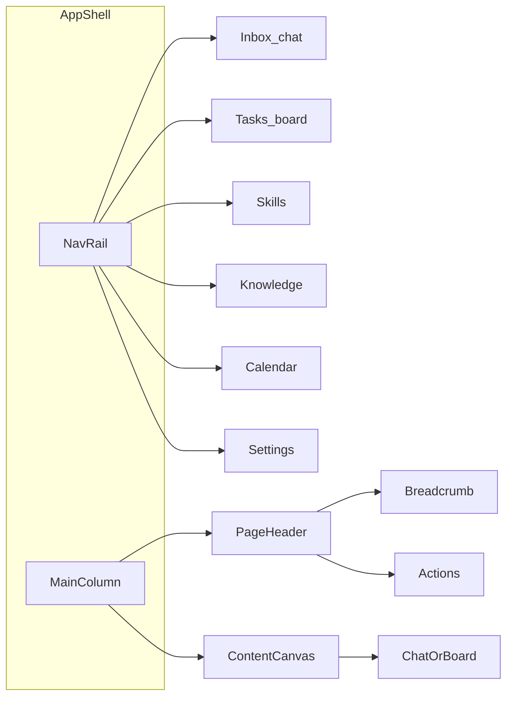

# Multica 式壳层 + 任务看板重构

## 目标结构

布局对照截图（学结构，不抄产品文案/源码）：

| Multica           | my-agent                        |
| ----------------- | ------------------------------- |
| Workspace 切换      | 工作目录 / Owner 头像区                |
| Inbox             | 聊天（会话列表 + Composer）             |
| Issues 看板         | 任务看板（`TaskStore`）               |
| Skills / Settings | 现有 SkillsPanel / SettingsModal  |
| 顶栏面包屑 + 工具条       | 统一 `PageHeader`                 |
| 窄图标侧栏             | `NavRail`（展开约 220px / 折叠约 56px） |

默认视图仍为 **Inbox（chat）**，避免打断现有对话习惯；侧栏顺序把 **Tasks** 放在 Inbox 之后、高亮样式对齐截图。

## 阶段 A：壳层重构（前端）

核心文件：

- 新建 `[frontend/src/components/shell/AppShell.tsx](frontend/src/components/shell/AppShell.tsx)`、`[NavRail.tsx](frontend/src/components/shell/NavRail.tsx)`、`[PageHeader.tsx](frontend/src/components/shell/PageHeader.tsx)`、`[SessionPanel.tsx](frontend/src/components/shell/SessionPanel.tsx)`
- 改写 `[frontend/src/App.tsx](frontend/src/App.tsx)`：`AppShell` 包住内容；按 `activeView` 渲染
- 拆分 `[frontend/src/components/Sidebar.tsx](frontend/src/components/Sidebar.tsx)`：导航进 `NavRail`；会话搜索/置顶/列表进 `SessionPanel`（仅 Inbox 显示，作为主区左侧二级栏，约 260px）
- `[ChatPane.tsx](frontend/src/components/ChatPane.tsx)` / `[SkillsPanel.tsx](frontend/src/components/SkillsPanel.tsx)` / `[KnowledgePanel.tsx](frontend/src/components/KnowledgePanel.tsx)` / `[CalendarPanel.tsx](frontend/src/components/CalendarPanel.tsx)`：去掉各自重复顶栏，标题与主操作上移到 `PageHeader`
- `[app-store.ts](frontend/src/stores/app-store.ts)`：`MainView` 增加 `"tasks"`；可用 `sidebarCollapsed` 控制 NavRail 宽/窄
- `[tokens.css](frontend/src/styles/tokens.css)`：`--rail-width`、`--header-height`、浅色 shell 背景（沿用主题 CSS 变量，避免紫渐变/奶油风）

`PageHeader` 约定：

- 左：`工作区名 › 当前视图`（Inbox / Tasks / Skills…）
- 中/左下（可选）：视图内控件位（Tasks 的 Filter 占位可先不做）
- 右：按视图挂载动作（Inbox：新建对话 + 宽度；Tasks：新建任务 + 计数）

## 阶段 B：任务看板 API（Python）

现有状态：`pending | planned | expired | done`（`[src/tools/task/store.py](src/tools/task/store.py)` 已有 `list_all` / `update_status`），但 **AppApi 无任务 JSON 接口**。

新增：

- `[src/ui/api/tasks.py](src/ui/api/tasks.py)` `TaskApiMixin`，挂到 `[src/ui/api/__init__.py](src/ui/api/__init__.py)` 的 `AppApi`
- 方法：
  - `list_tasks(include_done=True)` → `{ tasks: TaskDict[] }`
  - `add_task(payload)` → 复用 parse/defaults 或最小字段 `title/content/owner/due_at/status`
  - `update_task_status(task_id, status)` → 调 `TaskStore.update_status`
  - `delete_task(task_id)`
  - （可选）`update_task(task_id, payload)` 改标题/详情
- Controller 侧通过已有 `self._task_store` 访问（与 reminder 同源）
- `[frontend/src/bridge/types.ts](frontend/src/bridge/types.ts)` 同步 `TaskItem` + API 签名

看板列映射（固定四列，贴近截图语义）：

- **Todo** ← `pending`
- **Planned** ← `planned`
- **Overdue** ← `expired`
- **Done** ← `done`

卡片：`#id`、标题、内容摘要、owner、due、tags；拖到另一列即 `update_task_status`（本阶段用「列内移动按钮 / 下拉改状态」也可先落地，拖拽作为同 PR 内简单 HTML5 DnD）。

## 阶段 C：TasksPanel UI

- 新建 `[frontend/src/components/TasksPanel.tsx](frontend/src/components/TasksPanel.tsx)`（lazy）
- 顶栏动作：`+ New Task` 简易对话框（标题必填）
- 横向滚动四列；列头图标 + 计数；浅色列 tint（过期/完成用功能色，非装饰紫）
- NavRail 增加 Tasks 项；Inbox 仍对应 `chat`

## 明确不做

- 不引入 Go / Next / Electron，不复制 Multica 仓库源码
- 不做 Multica 的 Agents/Runtimes/Squads/多 Tab Chrome
- 不重做主题引擎；沿用现有 `theme_variables` + token
- `/tsk` 斜杠命令保留，与看板共用 `TaskStore`

## 验收

1. 壳层：窄侧栏 + 统一顶栏；Inbox 下二级会话栏可用；折叠侧栏正常
2. Tasks：能列出库内任务、改状态、新建、删除
3. `npm run build` 输出 `web/dist`；`python main.py` 可进新壳
4. `AGENT_UI=legacy` 仍可回退旧版
