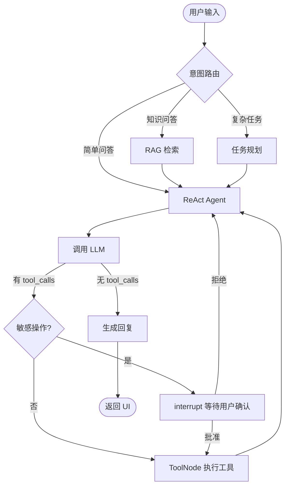

# 个人助理 Agent —— 设计方案（v2）

> 技术栈：**LangChain + LangGraph** | **pywebview + Web UI** | **可插拔外部 LLM API**  
> 注：早期草案曾规划 CustomTkinter；以 `doc/` 与当前实现为准。

---

## 一、项目概述

### 1.1 项目目标

构建一个以 LLM 为推理核心的**本地桌面个人助理 Agent**，通过自然语言理解用户意图，自主完成日常事务处理，包括：

- 任务管理（待办创建、提醒、优先级）
- 日程规划（日历查询、冲突检测）
- 信息检索（网页搜索、本地文件、知识库问答）
- 笔记整理（读写、摘要、标签）
- 跨应用操作（邮件、Notion/飞书等，按需扩展）

### 1.2 核心能力

| 能力域 | 具体功能 |
|--------|----------|
| 任务管理 | 创建/更新/删除待办、设置提醒、优先级排序 |
| 日程管理 | 查询/创建日历事件、时间冲突检测与提示 |
| 信息检索 | 网页搜索、本地文件检索、个人知识库 RAG |
| 笔记整理 | 读写笔记、内容摘要、标签分类 |
| 跨应用操作 | 发送邮件、操作 Notion/飞书文档等 |

### 1.3 非功能性需求

| 维度 | 目标 |
|------|------|
| 响应延迟 | 简单任务 < 3s，复杂多步任务 < 15s |
| 可用性 | 桌面常驻、系统托盘、定时 + 事件双触发 |
| 安全性 | 敏感操作二次确认；API Key 本地加密存储 |
| 可观测性 | 工具调用链、延迟、成功率日志 |
| 可扩展性 | LLM 提供商、工具、UI 模块均可独立替换 |

---

## 二、技术选型

### 2.1 核心框架：LangChain + LangGraph

| 层级 | 技术 | 职责 |
|------|------|------|
| 模型集成 | LangChain | LLM 统一接口、Tool 定义、Prompt、RAG 组件 |
| 编排运行时 | LangGraph | 有状态 Agent 图、Checkpoint、Human-in-the-loop |
| 预构建 Agent | `langgraph.prebuilt.create_react_agent` | ReAct 循环（思考→行动→观察） |
| 持久化 | `langgraph.checkpoint.sqlite.SqliteSaver` | 会话状态持久化、断点恢复 |

**选型理由**

- LangChain 提供成熟的 Tool / Retriever / Embedding 生态
- LangGraph 原生支持**有状态图**、**流式输出**、**中断等待用户确认**，适合桌面助理场景
- 不再使用已弃用的 `AgentExecutor`，统一走 LangGraph 图编排

### 2.2 UI 框架：Python + CustomTkinter

| 组件 | 说明 |
|------|------|
| CustomTkinter | 现代深色/浅色主题，基于 Tkinter，纯 Python 无浏览器依赖 |
| 线程模型 | UI 主线程 + Agent 后台线程，通过 `queue` 传递消息 |
| 流式渲染 | LangGraph `stream()` 事件逐 token / 逐步更新聊天窗口 |

**UI 功能模块**

```
┌─────────────────────────────────────────────────────┐
│  侧边栏          │  主聊天区                         │
│  · 会话列表      │  · 消息气泡（用户/助手/工具）      │
│  · 新建会话      │  · 流式打字效果                   │
│  · 设置入口      │  · 工具调用卡片（可折叠）          │
├──────────────────┼───────────────────────────────────┤
│  底部输入区：文本框 + 发送 + 停止 + 附件              │
├─────────────────────────────────────────────────────┤
│  状态栏：当前模型 | Token 用量 | 连接状态              │
└─────────────────────────────────────────────────────┘
```

**设置面板（独立窗口）**

- LLM 提供商配置（API Base URL、API Key、Model Name）
- 温度 / Max Tokens / 超时 / 重试次数
- 工具开关与权限级别
- 知识库目录、向量库路径

### 2.3 LLM：可插拔外部 API 架构

**设计原则：业务代码不绑定任何单一厂商，通过配置切换 Provider。**

#### 2.3.1 Provider 抽象层

```python
# config/llm_providers.yaml 示例
default_provider: deepseek

providers:
  deepseek:
    type: openai_compatible      # OpenAI 兼容协议
    base_url: https://api.deepseek.com/v1
    model: deepseek-chat
    api_key_env: DEEPSEEK_API_KEY
    supports_tool_call: true

  openai:
    type: openai_compatible
    base_url: https://api.openai.com/v1
    model: gpt-4o
    api_key_env: OPENAI_API_KEY
    supports_tool_call: true

  qwen:
    type: openai_compatible
    base_url: https://dashscope.aliyuncs.com/compatible-mode/v1
    model: qwen-plus
    api_key_env: DASHSCOPE_API_KEY
    supports_tool_call: true

  ollama:
    type: ollama                   # 本地部署
    base_url: http://localhost:11434
    model: qwen2.5:7b
    supports_tool_call: true

  custom:
    type: openai_compatible      # 任意自建/第三方网关
    base_url: https://your-gateway.com/v1
    model: your-model-name
    api_key_env: CUSTOM_API_KEY
    supports_tool_call: true
```

#### 2.3.2 统一工厂方法

```python
from langchain.chat_models import init_chat_model

def create_llm(provider_cfg: dict):
    """根据配置创建 LLM 实例，支持所有 OpenAI 兼容 API。"""
    if provider_cfg["type"] == "openai_compatible":
        return init_chat_model(
            model=provider_cfg["model"],
            model_provider="openai",
            base_url=provider_cfg["base_url"],
            api_key=resolve_api_key(provider_cfg),
            temperature=provider_cfg.get("temperature", 0.7),
            timeout=provider_cfg.get("timeout", 60),
        )
    elif provider_cfg["type"] == "ollama":
        return init_chat_model(
            model=f"ollama:{provider_cfg['model']}",
            base_url=provider_cfg["base_url"],
        )
    # 可扩展 anthropic / google 等原生 Provider
    raise ValueError(f"Unknown provider type: {provider_cfg['type']}")
```

#### 2.3.3 Provider 能力矩阵

| Provider 类型 | 接入方式 | Tool Call | 适用场景 |
|---------------|----------|-----------|----------|
| OpenAI 兼容 API | `base_url` + `api_key` | ✅ | DeepSeek、Qwen、Moonshot、自建网关 |
| OpenAI 官方 | `openai:gpt-4o` | ✅ | 高质量推理 |
| Ollama 本地 | `ollama:model` | ✅（视模型） | 隐私敏感、离线 |
| Anthropic | `claude-sonnet-4-6` | ✅ | 长上下文 |
| OpenRouter | `openrouter:provider/model` | ✅ | 多模型统一入口 |

> **重要**：优先选用**原生支持 Function Calling / Tool Use** 的模型；通用推理模型（如部分 R1 系列）在多工具连续调用场景下延迟高、成功率低。

---

## 三、系统架构

### 3.1 分层架构

```
┌──────────────────────────────────────────────────────────────┐
│                    表现层 (CustomTkinter)                     │
│   ChatWindow │ SettingsDialog │ ConfirmDialog │ SystemTray   │
└────────────────────────────┬─────────────────────────────────┘
                             │ queue / callback
┌────────────────────────────▼─────────────────────────────────┐
│                    应用层 (Application Service)               │
│   SessionManager │ AgentRunner │ StreamHandler │ ConfigMgr    │
└────────────────────────────┬─────────────────────────────────┘
                             │ invoke / stream
┌────────────────────────────▼─────────────────────────────────┐
│                 编排层 (LangGraph ReAct)                        │
│   create_react_agent │ Human-in-the-loop │ Checkpoint         │
│   （意图路由在 UI 层完成；无独立 ROUTER/PLAN 节点）              │
└──────────┬─────────────────────────────┬─────────────────────┘
           │                             │
┌──────────▼──────────┐       ┌──────────▼──────────────────────┐
│   记忆层             │       │   工具层 (LangChain @tool)       │
│ Short: messages[]   │       │ search │ calendar │ file │ todo  │
│ Long: 文件记忆+FAISS│       │ rag │ browser │ gateway …       │
└─────────────────────┘       └─────────────────────────────────┘
           │
┌──────────▼──────────────────────────────────────────────────────┐
│              基础设施层                                         │
│   SQLite │ FAISS/Chroma │ keyring │ loguru │ APScheduler      │
└───────────────────────────────────────────────────────────────┘
```

### 3.2 LangGraph Agent 工作流



**核心节点说明**

| 节点 | 实现 | 说明 |
|------|------|------|
| ReAct Agent | `create_react_agent(model, tools, checkpointer=...)` | 标准推理-行动循环 |
| ToolNode | `langgraph.prebuilt.ToolNode(tools)` | 批量执行工具调用 |
| Human-in-the-loop | `langgraph.types.interrupt()` | 敏感操作暂停，等待 UI 确认 |
| Checkpoint | `SqliteSaver` | 会话持久化，支持多轮恢复 |

### 3.3 Agent 状态定义

```python
from typing import Annotated
from typing_extensions import TypedDict
from langgraph.graph.message import add_messages

class AgentState(TypedDict):
    messages: Annotated[list, add_messages]   # 对话历史（短期记忆）
    pending_action: dict | None               # 待确认的操作
    task_plan: list[str] | None               # 复杂任务步骤
    retrieved_docs: list | None               # RAG 检索结果
    metadata: dict                            # token 用量、耗时等
```

### 3.4 UI ↔ Agent 通信

```python
# 伪代码：UI 线程安全调用 Agent
class AgentRunner:
    def __init__(self, graph, event_queue: queue.Queue):
        self.graph = graph
        self.queue = event_queue

    def run_async(self, user_input: str, thread_id: str):
        def _worker():
            config = {"configurable": {"thread_id": thread_id}}
            for event in self.graph.stream(
                {"messages": [{"role": "user", "content": user_input}]},
                config=config,
                stream_mode="messages",
            ):
                self.queue.put(("stream", event))
            self.queue.put(("done", None))
        threading.Thread(target=_worker, daemon=True).start()
```

UI 主线程通过 `after(50, poll_queue)` 轮询队列，更新聊天界面；遇到 `interrupt` 事件时弹出确认对话框，用户响应后调用 `graph.invoke(Command(resume=...))` 恢复执行。

---

## 四、模块详细设计

### 4.1 记忆系统

| 类型 | 存储 | 实现 | 用途 |
|------|------|------|------|
| 短期记忆 | LangGraph State `messages` | Checkpoint 自动持久化 | 当前会话上下文 |
| 长期记忆 | `langgraph.store` | `InMemoryStore` → SQLite Store | 用户偏好、常用模板 |
| 知识库 | FAISS / Chroma | LangChain `VectorStoreRetriever` | 个人文档 RAG |

**检索策略（每次用户输入前）**

1. 加载 Checkpoint 中的 `messages`（短期）
2. 从 Store 检索用户偏好（长期）
3. 若检测到知识问答意图，执行 RAG 检索，将结果注入 System Prompt

### 4.2 工具层规范

每个工具使用 LangChain `@tool` 装饰器，包含清晰 docstring（LLM 靠此选择工具）：

```python
from langchain.tools import tool

@tool
def create_todo(title: str, due_date: str = "", priority: str = "normal") -> str:
    """创建一条待办事项。

    Args:
        title: 待办标题
        due_date: 截止日期，ISO 8601 格式，如 2026-06-20
        priority: 优先级，可选 low / normal / high
    """
    ...

@tool
def send_email(to: str, subject: str, body: str) -> str:
    """发送电子邮件。此操作需要用户确认后才会执行。"""
    ...
```

**工具元数据扩展**

```python
TOOL_META = {
    "send_email":       {"risk": "high",  "requires_confirmation": True},
    "write_file":       {"risk": "high",  "requires_confirmation": True},
    "create_calendar_event": {"risk": "medium", "requires_confirmation": True},
    "web_search":       {"risk": "low",   "requires_confirmation": False},
    "read_file":        {"risk": "low",   "requires_confirmation": False},
    "create_todo":      {"risk": "low",   "requires_confirmation": False},
    "search_notes":     {"risk": "low",   "requires_confirmation": False},
}
```

**MVP 工具清单**

| 工具 | 功能 | 阶段 |
|------|------|------|
| `web_search` | 网页搜索 | MVP |
| `read_calendar` / `create_calendar_event` | 日程读写 | MVP |
| `create_todo` / `list_todos` | 待办管理 | MVP |
| `read_file` / `write_file` | 文件读写 | Phase 2 |
| `send_email` | 邮件发送 | Phase 2 |
| `search_notes` | 知识库 RAG | Phase 2 |
| `browser_control` | 浏览器自动化 | Phase 3 |

### 4.3 安全设计

**敏感操作 Human-in-the-loop 流程**

```
Agent 生成 tool_call
    → LangGraph interrupt() 暂停图执行
    → UI 弹出 ConfirmDialog（展示操作预览）
    → 用户 [批准] / [编辑参数] / [拒绝]
    → graph.invoke(Command(resume=user_response)) 恢复
    → 批准则执行工具，拒绝则让 Agent 重新规划
```

**其他安全措施**

- API Key 通过 `keyring` 存入系统密钥链，不写明文配置文件
- 文件工具限制在 `~/AssistantWorkspace` 沙箱目录
- 工具调用日志审计（操作类型、参数摘要、时间戳）
- 输入校验：拒绝 shell 注入模式（如 `; rm -rf`）

### 4.4 RAG 知识库（Phase 2）

```
文档导入 → RecursiveCharacterTextSplitter 分块
         → Embedding（与 LLM 同 Provider 或本地模型）
         → 存入 FAISS/Chroma
         → 检索时 top-k + MMR 去重
         → 注入 Prompt 上下文
```

---

## 五、项目结构

```
my-agent/
├── main.py                      # 入口：启动 CustomTkinter 应用
├── pyproject.toml               # 依赖管理
├── config/
│   ├── llm_providers.yaml       # LLM 提供商配置
│   ├── tools.yaml               # 工具开关与权限
│   └── app.yaml                 # 应用全局配置
├── src/
│   ├── ui/
│   │   ├── app.py               # 主窗口
│   │   ├── chat_panel.py        # 聊天面板
│   │   ├── settings_dialog.py   # 设置对话框
│   │   ├── confirm_dialog.py    # 敏感操作确认
│   │   └── widgets/             # 自定义组件
│   ├── agent/
│   │   ├── graph.py             # LangGraph 图构建
│   │   ├── nodes.py             # 自定义节点（规划、RAG）
│   │   ├── state.py             # AgentState 定义
│   │   └── runner.py            # AgentRunner（线程 + 流式）
│   ├── llm/
│   │   ├── factory.py           # create_llm() 工厂
│   │   └── providers.py         # Provider 配置解析
│   ├── tools/
│   │   ├── __init__.py          # 工具注册表
│   │   ├── search.py
│   │   ├── calendar.py
│   │   ├── todo.py
│   │   ├── file.py
│   │   └── email.py
│   ├── memory/
│   │   ├── store.py             # 长期记忆 Store
│   │   └── rag.py               # RAG 管线
│   └── infra/
│       ├── config.py            # 配置加载
│       ├── logger.py            # 日志
│       └── scheduler.py         # 定时任务
├── data/
│   ├── checkpoints/             # LangGraph SQLite Checkpoint
│   ├── vectorstore/             # FAISS 索引
│   └── workspace/               # 文件操作沙箱
└── tests/
    ├── test_llm_factory.py
    ├── test_tools.py
    └── test_agent_graph.py
```

---

## 六、核心依赖

```toml
[project]
dependencies = [
    "langchain>=0.3",
    "langgraph>=0.3",
    "langchain-openai",          # OpenAI 兼容 API
    "langchain-community",       # 社区工具集成
    "customtkinter>=5.2",
    "pyyaml",
    "keyring",                   # API Key 安全存储
    "loguru",                    # 日志
    "apscheduler",               # 定时提醒
    "faiss-cpu",                 # 向量检索（轻量）
    "chromadb",                  # 向量库（可选）
]
```

---

## 七、实施路线

### Phase 1 — MVP（2 周）

| 任务 | 产出 |
|------|------|
| 项目脚手架 + 依赖 | `pyproject.toml`、目录结构 |
| LLM 工厂 + 配置 | 支持 ≥2 个 OpenAI 兼容 Provider 切换 |
| LangGraph ReAct Agent | `create_react_agent` + 3 个基础工具 |
| CustomTkinter 聊天 UI | 消息收发、流式显示、设置面板 |
| SQLite Checkpoint | 会话持久化、多会话管理 |

**MVP 验收标准**：用户在桌面 UI 中切换 LLM Provider，通过自然语言完成搜索、查日程、建待办。

### Phase 2 — 核心功能（3 周）

| 任务 | 产出 |
|------|------|
| 扩展工具集 | 文件读写、邮件、笔记 RAG |
| 长期记忆 Store | 用户偏好持久化 |
| Human-in-the-loop | 敏感操作确认对话框 |
| 知识库导入 UI | 拖拽上传文档、自动索引 |

### Phase 3 — 智能化（2 周）

| 任务 | 产出 |
|------|------|
| 复杂任务规划节点 | 多步骤任务自动分解 |
| 反思节点 | 执行结果自检与重试 |
| 系统托盘 + 定时触发 | 后台提醒、定时任务 |

### Phase 4 — 生产就绪（2 周）

| 任务 | 产出 |
|------|------|
| 日志与追踪 | 工具调用链可视化（UI 面板） |
| 异常恢复 | 网络超时重试、Provider 降级 |
| 打包发布 | PyInstaller 单文件 exe |
| 测试覆盖 | 核心模块单元测试 |

---

## 八、关键技术要点

### 8.1 LangGraph vs 旧版 AgentExecutor

| 对比项 | AgentExecutor（已弃用） | LangGraph |
|--------|------------------------|-----------|
| 状态管理 | 无原生持久化 | Checkpoint 原生支持 |
| 人工介入 | 难以实现 | `interrupt()` 一等公民 |
| 流式输出 | 有限 | `stream()` 多模式 |
| 自定义流程 | 受限 | StateGraph 任意编排 |

### 8.2 流式输出集成

```python
# stream_mode="messages" 逐 token 推送至 UI
for msg, metadata in graph.stream(input, stream_mode="messages"):
    if msg.content:
        ui.append_token(msg.content)
```

### 8.3 多 Provider 降级策略

```python
PROVIDER_FALLBACK_CHAIN = ["deepseek", "qwen", "ollama"]

def invoke_with_fallback(prompt, providers):
    for name in providers:
        try:
            llm = create_llm(load_provider(name))
            return llm.invoke(prompt)
        except (TimeoutError, ConnectionError) as e:
            logger.warning(f"Provider {name} failed: {e}")
    raise RuntimeError("All LLM providers unavailable")
```

### 8.4 CustomTkinter 性能注意

- Agent 推理**不可**在主线程执行，否则 UI 冻结
- 流式 token 更新频率限制（每 50ms 批量刷新一次）
- 长对话做消息窗口截断（保留最近 N 轮 + Checkpoint 摘要）

---

## 九、风险与应对

| 风险 | 影响 | 应对 |
|------|------|------|
| 模型 Tool Call 不稳定 | 工具调用失败 | 选 Function Call 优化模型；加重试 + 降级 |
| API 限流 / 超时 | 响应中断 | 超时配置 + Provider 降级链 |
| 敏感操作误执行 | 数据丢失 / 误发 | Human-in-the-loop 强制确认 |
| UI 线程阻塞 | 界面卡死 | 严格后台线程 + Queue 通信 |
| 向量库体积膨胀 | 磁盘占用 | 定期清理 + 分库管理 |

---

## 十、总结

本方案以 **LangGraph 有状态 Agent 图**为编排核心，**LangChain** 提供模型与工具集成，**CustomTkinter** 构建本地桌面交互，**可插拔 LLM Provider 层**确保不绑定单一厂商。

推荐实施路径：

```
MVP（对话 + 3 工具 + UI）
  → 核心功能（RAG + 安全确认 + 扩展工具）
    → 智能化（规划 + 反思 + 后台触发）
      → 生产就绪（打包 + 测试 + 降级）
```

每个阶段均有明确验收标准，确保持续可交付。
